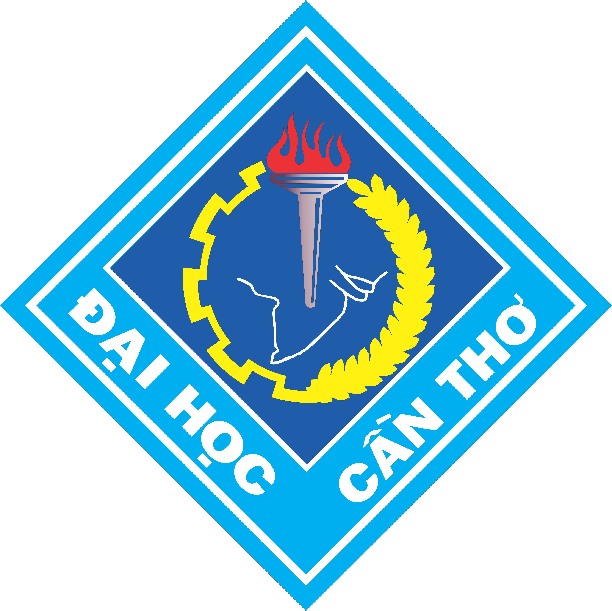
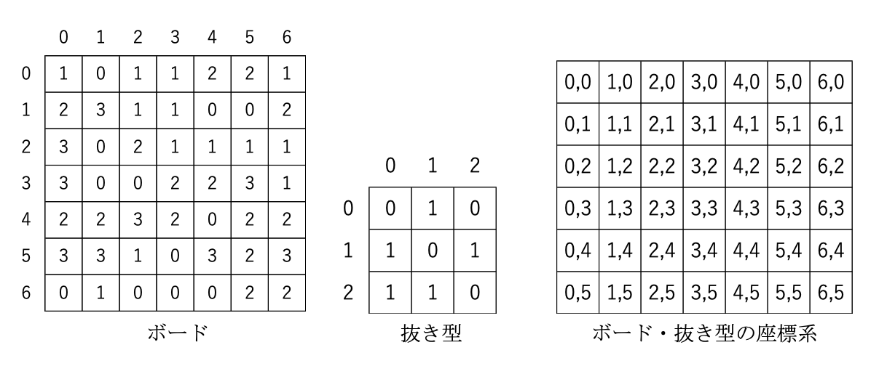
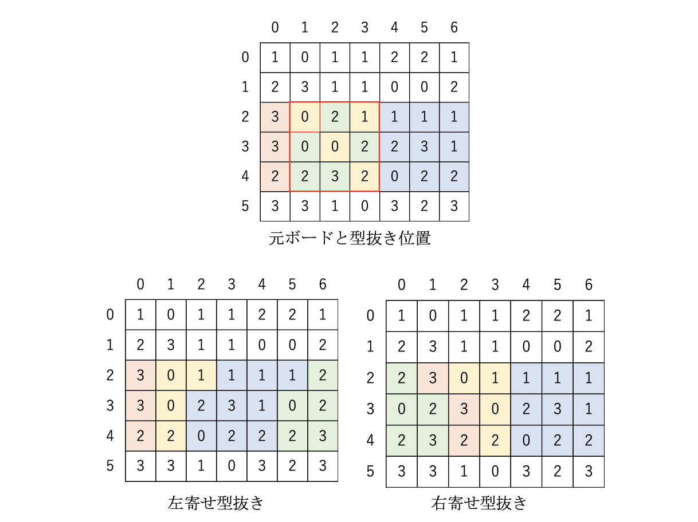
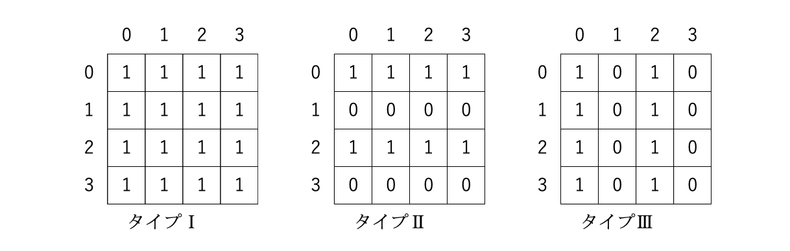
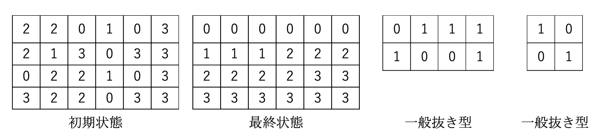

## Procon 2024

### Hướng dẫn về hạng mục thi đấu

**"Shin - Hãy hồi sinh di sản thế giới"**

### Tổng quan hạng mục thi đấu

Hạng mục thi đấu năm nay sẽ được tổ chức với mô típ phục chế di sản văn hóa. Tỉnh Nara là một trong những kho tàng di sản thế giới của Nhật Bản. Các công trình kiến ​​trúc Phật giáo ở khu vực chùa Horyuji là di sản thế giới đầu tiên ở Nhật Bản (di sản văn hóa) được công nhận vào năm 1993. Ngoài ra, vào năm 1998, các di sản văn hóa của cố đô Nara và vào năm 2004, các địa điểm linh thiêng và tuyến đường hành hương trên dãy núi Kii cũng được công nhận. Tuy nhiên, nhiều di sản văn hóa quý giá này đã bị hư hại nặng nề do thiên tai, nhân tai, cũng như mưa gió trong thời gian dài, và đã mất đi màu sắc ban đầu. Các hoạt động bảo tồn và phục hồi quy mô lớn đã được thực hiện ở nhiều nơi để khôi phục những di sản văn hóa này đến từng chi tiết. Nhờ trí tuệ và nỗ lực của những người đi trước, chúng ta có thể được chiêm ngưỡng những tác phẩm tuyệt đẹp đã được phục chế.

Do đó, tiếp nối chủ đề "Hãy hồi sinh di sản thế giới" của cuộc thi lần thứ 22 được tổ chức tại Maizuru, tỉnh Kyoto, một kho tàng di sản thế giới khác, chúng tôi đã chọn "Shin - Hãy hồi sinh di sản thế giới" là chủ đề mới cho cuộc thi năm nay.

Trong cuộc thi, đầu tiên, bạn sẽ được cung cấp một bảng bao gồm nhiều mảnh ghép (di sản văn hóa trước khi phục chế) và nhiều hình dạng (dụng cụ phục chế). Khi áp dụng một hình dạng lên bảng, các mảnh ghép trùng khớp với hình dạng đó sẽ bị loại bỏ, và các mảnh ghép bị loại bỏ sẽ được lấp đầy từ trên, dưới, trái hoặc phải. Nhiệm vụ của bạn là áp dụng các hình dạng một cách khéo léo để biến đổi bảng thành hình dạng cuối cùng (di sản văn hóa sau khi phục chế). Đội nào "phục chế" di sản văn hóa trước khi phục chế thành di sản văn hóa sau khi phục chế với số lần di chuyển ít nhất và nhanh nhất sẽ giành chiến thắng trong cuộc thi.

**Bảng và hình dạng**

- Các phần tử cấu thành của bảng được gọi là **mảnh ghép**, và bảng được tạo thành bằng cách sắp xếp các mảnh ghép theo hình chữ nhật. Kích thước bảng (số lượng mảnh ghép) có thể lên tới 256 mảnh ghép theo chiều dọc và chiều ngang, tối thiểu là 32 mảnh ghép, và số lượng mảnh ghép theo chiều dọc và chiều ngang không nhất thiết phải giống nhau. Kích thước bảng thay đổi tùy theo bài toán.

- Các mảnh ghép được gán một giá trị số nguyên từ 0 đến 3.

- Mỗi giá trị từ 0 đến 3 được gán cho ít nhất 10% tổng số mảnh ghép.

- Các phần tử cấu thành của hình dạng được gọi là **ô**, và hình dạng được tạo thành bằng cách sắp xếp các ô theo hình chữ nhật. Kích thước hình dạng (số lượng ô) có thể lên tới 256 ô theo chiều dọc và chiều ngang, tối thiểu là 1 ô, và số lượng ô theo chiều dọc và chiều ngang không nhất thiết phải giống nhau. Kích thước hình dạng thay đổi tùy theo hình dạng.

- Các ô được gán giá trị 0 hoặc 1. Không có hình dạng nào mà tất cả các ô đều có giá trị 0, nhưng không có giới hạn nào về tỷ lệ 0 và 1.

- Hình 1 cho thấy một ví dụ về bảng, hình dạng và hệ tọa độ. Lưu ý rằng mặc dù kích thước bảng tối thiểu là 32x32, nhưng nó được hiển thị với một bảng nhỏ hơn để dễ hiểu.

**Cắt hình**

- Việc áp dụng một hình dạng cho một khu vực của bảng được gọi là **cắt hình**, và mỗi lần cắt hình được tính là một **lượt di chuyển**.

- Bạn có thể cắt hình nhiều lần bằng cùng một hình dạng.

- Cắt hình được thực hiện bằng cách thực hiện tuần tự các thao tác sau trên bảng:

  1. Loại bỏ các mảnh ghép trên bảng tương ứng với các ô có giá trị 1 của hình dạng.
  2. Dịch chuyển các mảnh ghép còn lại trên bảng theo hướng được chỉ định.
  3. Trả lại các mảnh ghép đã loại bỏ ở bước ① vào khoảng trống theo thứ tự ban đầu của chúng.

- Cắt hình có thể được áp dụng cho bất kỳ vị trí nào trên bảng, và bạn cũng có thể cắt hình vượt ra ngoài bảng nếu một phần của hình dạng chồng lên bảng.



Hình 1: Ví dụ về bảng và hình dạng

- Hình ảnh này cho thấy một bảng nhỏ với các mảnh ghép được đánh số từ 0 đến 3.
- Bên cạnh bảng là một hình dạng nhỏ hơn với các ô được đánh số 0 hoặc 1.
- Phía dưới là hệ tọa độ của bảng và hình dạng, bắt đầu từ (0,0) ở góc trên bên trái.



[Hình 2: Ví dụ về cắt hình]

- Hình ảnh này cho thấy ba bảng: bảng gốc, bảng sau khi cắt hình và dịch trái, và bảng sau khi cắt hình và dịch phải.
- Bảng gốc giống như bảng trong Hình 1.
- Hai bảng còn lại cho thấy kết quả sau khi áp dụng hình dạng trong Hình 1 lên bảng gốc tại vị trí (1,2) và dịch các mảnh ghép sang trái hoặc phải.

**Bài toán**

- Một bài toán bao gồm trạng thái ban đầu, trạng thái cuối cùng của bảng và nhiều hình dạng.

- Kích thước bảng của trạng thái ban đầu và trạng thái cuối cùng là giống nhau, và số lượng mảnh ghép được gán cùng một giá trị là như nhau.

- Có 25 hình dạng, bao gồm 3 loại như trong Hình 3, mỗi loại có kích thước dọc và ngang là 1, 2, 4, 8, 16, 32, 64, 128, 256 (3 loại có kích thước 1 là giống hệt nhau). Những hình dạng này được gọi là **hình dạng cố định**, và các hình dạng khác được gọi là **hình dạng chung**.



[Hình 3: Ví dụ về hình dạng cố định (kích thước 4)]

- Hình ảnh này cho thấy ba loại hình dạng cố định với kích thước 4x4:

  - Loại I: Tất cả các ô đều là 1.
  - Loại II: Các ô ở hàng chẵn là 1, hàng lẻ là 0.
  - Loại III: Các ô ở cột chẵn là 1, cột lẻ là 0.

- Các hình dạng được đánh số, bắt đầu từ 0 cho hình dạng cố định và tiếp tục cho hình dạng chung. Nói cách khác, hình dạng chung bắt đầu từ số 25.

- Các hình dạng cố định được đánh số theo thứ tự kích thước tăng dần, bắt đầu từ 0 cho kích thước 1, 1, 2, 3 cho loại I, II, III có kích thước 2, và kết thúc bằng 22, 23, 24 cho loại I, II, III có kích thước 256.



[Hình 4: Ví dụ về bài toán]

- Hình ảnh này cho thấy trạng thái ban đầu và trạng thái cuối cùng của một bảng, cùng với hai hình dạng chung.
- Mục tiêu là sử dụng các hình dạng cố định và hình dạng chung để biến đổi bảng từ trạng thái ban đầu thành trạng thái cuối cùng.

**Định dạng bài toán**

- Bài toán được cung cấp ở định dạng dữ liệu JSON như sau, bao gồm trạng thái ban đầu, trạng thái cuối cùng của bảng và các hình dạng chung. Các hình dạng cố định không được bao gồm trong định dạng bài toán.

- Thông tin bảng được lưu trữ trong khóa "board", thông tin hình dạng chung được lưu trữ trong khóa "general".

- Thông tin bảng bao gồm chiều rộng và chiều cao của bảng được lưu trữ trong khóa "width", "height", và trạng thái ban đầu và trạng thái cuối cùng được lưu trữ trong khóa "start", "goal". Giá trị của các mảnh ghép trong trạng thái ban đầu và trạng thái cuối cùng được ghi lại liên tục cho mỗi hàng.

- Thông tin hình dạng chung bao gồm số lượng hình dạng chung được lưu trữ trong khóa "n", và thông tin của từng hình dạng chung được lưu trữ trong khóa "patterns".

- Thông tin của mỗi hình dạng chung bao gồm số hình dạng được lưu trữ trong khóa "p", chiều rộng và chiều cao của hình dạng được lưu trữ trong khóa "width", "height", và giá trị của các ô được lưu trữ trong khóa "cells". Giá trị của các ô được ghi lại liên tục cho mỗi hàng.

- Dưới đây là ví dụ về dữ liệu bài toán cho ví dụ bài toán trong Hình 4.

```json
{
  "board": {
    "width": 6,
    "height": 4,
    "start": ["220103", "213033", "022103", "322033"],
    "goal": ["000000", "111222", "222233", "333333"]
  },
  "general": {
    "n": 2,
    "patterns": [
      {
        "p": 25,
        "width": 4,
        "height": 2,
        "cells": ["0111", "1001"]
      },
      {
        "p": 26,
        "width": 2,
        "height": 2,
        "cells": ["10", "01"]
      }
    ]
  }
}
```

**Định dạng câu trả lời**

- Câu trả lời được ghi lại ở định dạng dữ liệu JSON như sau, bao gồm thông tin cắt hình.

- Số lượt di chuyển được ghi lại trong khóa "n".

- Thông tin cắt hình được ghi lại theo thứ tự từ lượt di chuyển đầu tiên trong khóa "ops".

- Thông tin của mỗi lần cắt hình bao gồm 4 yếu tố: số hình dạng, tọa độ X áp dụng, tọa độ Y áp dụng, hướng dịch chuyển (lên: 0, xuống: 1, trái: 2, phải: 3), và các yếu tố này được ghi lại trong khóa "p", "x", "y", "s".

- Câu trả lời có số lượt di chuyển và số lượng thông tin cắt hình khác nhau sẽ không hợp lệ.

- Ngoài ra, câu trả lời không khớp với định dạng sẽ không hợp lệ.

- Dưới đây là ví dụ về câu trả lời. Ví dụ câu trả lời này cho biết số lượt di chuyển là 3, lượt di chuyển đầu tiên là áp dụng hình dạng 4 tại (5, 6) sang trái, lượt di chuyển thứ hai là áp dụng hình dạng 11 tại (3, -12) sang phải và lượt di chuyển thứ ba là áp dụng hình dạng 25 tại (6, 0) lên trên.

```json
{
  "n": 3,
  "ops": [
    {
      "p": 4,
      "x": 5,
      "y": 6,
      "s": 2
    },
    {
      "p": 11,
      "x": 3,
      "y": -12,
      "s": 3
    },
    {
      "p": 25,
      "x": 6,
      "y": 0,
      "s": 0
    }
  ]
}
```

**Diễn biến trận đấu**

(1) Một trận đấu được diễn ra đồng thời bởi nhiều đội. Số lượng đội thi đấu trong mỗi trận đấu sẽ khác nhau tùy thuộc vào sự kết hợp.

(2) Số lượng đội thi đấu trong mỗi trận đấu sẽ được thông báo trong tài liệu hướng dẫn của vòng chung kết.

(3) Một trận đấu bao gồm 1 bài toán.

(4) Mỗi trận đấu sẽ có giới hạn thời gian. Giới hạn thời gian dự kiến ​​là khoảng 5 phút.

(5) Kích thước bảng và số lượng, kích thước hình dạng có thể khác nhau tùy theo bài toán.

(6) Kích thước bảng, số lượng và kích thước hình dạng sẽ được thông báo trước khi trận đấu bắt đầu.

(7) Bài toán sẽ được cung cấp qua mạng khi trận đấu bắt đầu.

(8) Mỗi đội sẽ giải bài toán và gửi câu trả lời qua mạng trong thời gian giới hạn.

(9) Khi câu trả lời được gửi từ mỗi đội được máy chủ tiếp nhận, bạn sẽ nhận được thông tin cho biết câu trả lời đã được tiếp nhận bình thường hay không hợp lệ (lỗi định dạng).

(10) Bạn có thể gửi lại câu trả lời trong thời gian giới hạn, nhưng việc gửi câu trả lời với số lượng hoặc dung lượng quá lớn có thể bị coi là hành vi cản trở và có thể dẫn đến bị loại.

(11) Câu trả lời được tiếp nhận cuối cùng sẽ có hiệu lực.

**Xác định thắng thua**

Thắng thua sẽ được xác định theo thứ tự ưu tiên sau, dựa trên mức độ trùng khớp, số lượt di chuyển và thời gian trả lời:

(1) Đội có ít mảnh ghép không khớp với trạng thái cuối cùng nhất sẽ thắng.

(2) Đội có ít lượt di chuyển nhất sẽ thắng.

(3) Đội có thời gian trả lời cuối cùng sớm nhất sẽ thắng.

(4) Thắng thua sẽ được quyết định bằng cách tung xúc xắc hoặc được coi là hòa.

**Phương thức liên lạc**

- Dự kiến ​​sẽ kết nối PC của mỗi đội với mạng LAN có dây được chuẩn bị trong khu vực thi đấu và cho phép gửi và nhận dữ liệu bằng cách sử dụng định dạng POST/GET của http.

- Giao thức liên lạc chi tiết và thông tin liên quan đến hệ thống trả lời sẽ được công bố trên trang web chính thức của ProCon vào khoảng đầu tháng 7.

**Lưu ý**

- Các thiết bị máy tính có thể mang vào và sử dụng trong cuộc thi được giới hạn trong 3 thiết bị di động và có thể lập trình. Trong số đó, ít nhất 1 thiết bị phải có cổng LAN RJ45 10BASE-T/100BASE-TX/1000BASE-T, có khả năng kết nối TCP/IP và được sử dụng để gửi câu trả lời.

- Dự kiến ​​sẽ cung cấp ổ cắm điện với 4 hoặc nhiều hơn cho mỗi đội trong khu vực thi đấu. Vui lòng đảm bảo tổng công suất không vượt quá 500W.

- Dự kiến ​​sẽ cung cấp 1 cáp LAN cho mỗi đội để kết nối với mạng thi đấu. Nếu cần kết nối nhiều máy tính với mạng thi đấu, mỗi đội vui lòng tự chuẩn bị các thiết bị như bộ chuyển mạch HUB.

- Liên lạc không dây giữa các thiết bị được mang vào bằng Bluetooth, v.v. được cho phép, nhưng liên lạc qua Wi-Fi không được phép.

- Trao đổi thông tin trong đội được phép trong cuộc thi, nhưng trao đổi thông tin với bên ngoài đội không được phép. Ngoài ra, liên lạc với các thiết bị khác ngoài thiết bị được mang vào không được phép.

- Các hành vi cản trở máy chủ hoặc quá trình thi đấu của các đội khác không được phép. Trong trường hợp bị đánh giá là có hành vi cản trở quá trình thi đấu, cản trở ban giám khảo hoặc các đội khác, hoặc các hành vi bị cấm khác, bạn có thể bị loại.

- Trong trường hợp có sự cố với hệ thống của ban tổ chức liên quan đến việc gửi và nhận dữ liệu qua mạng, có thể sẽ chuyển sang chế độ ngoại tuyến. Trong trường hợp này, thời gian thi đấu, v.v. có thể bị thay đổi.

- Trong trường hợp có sự cố với phía ban tổ chức, có khả năng sẽ chuẩn bị bài toán khác và thi đấu lại.

- Dữ liệu được sử dụng trong cuộc thi và dữ liệu được gửi đến máy chủ bởi mỗi đội có thể được công bố trên trang web chính thức của ProCon, v.v. sau khi cuộc thi kết thúc.

- Trong cuộc thi, người chơi và mặt bàn (bao gồm màn hình máy tính, thao tác, ghi chú trên bàn, v.v.) có thể được quay phim và ghi hình, đồng thời được hiển thị trên màn hình, v.v.

- Trong cuộc thi, ban giám khảo có thể xem người chơi và mặt bàn (bao gồm màn hình máy tính, thao tác, ghi chú trên bàn, v.v.) cho mục đích đánh giá.

Vietsub: Minh Thắng
